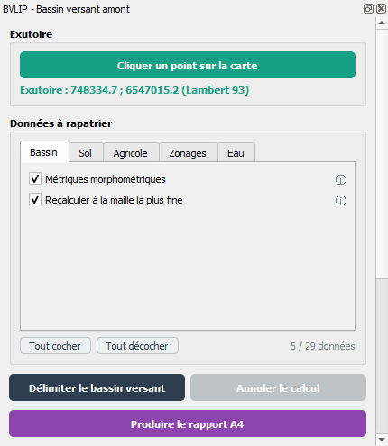
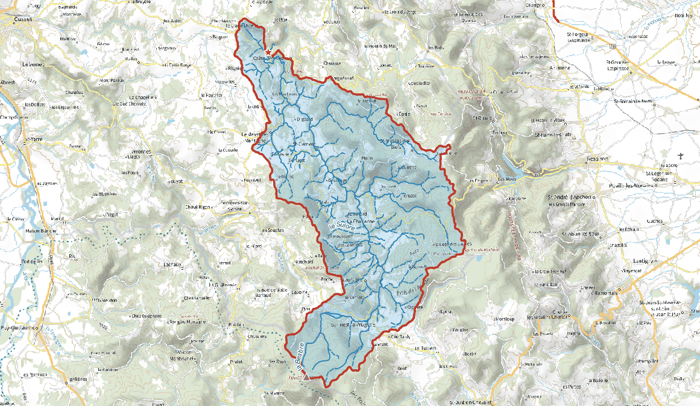
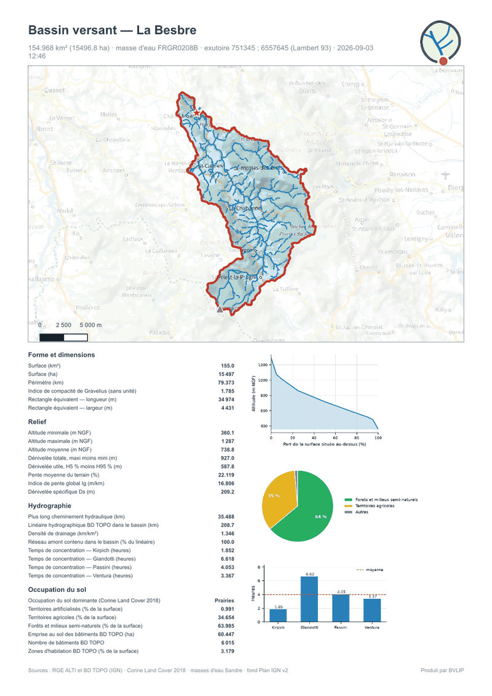
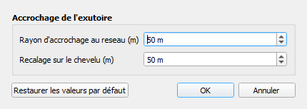
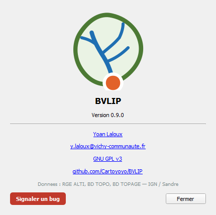

<div align="center">

# BVLIP


**Cliquez un point sur un cours d'eau : le bassin versant qui l'alimente est délimité, caractérisé et mis en rapport — sans préparer la moindre donnée.**

[](https://qgis.org)
[](metadata.txt)
[](LICENSE)
[](https://geoservices.ign.fr)
[](i18n/__init__.py)

</div>

---

<div align="center">

## Aperçu rapide · Quick Overview

| 1 — Cliquer | 2 — Délimiter | 3 — Rapporter |
|:---:|:---:|:---:|
|  |  |  |
| Un point sur la carte,<br>et le calcul part en tâche de fond | Le bassin, son chevelu<br>et les quatre états de l'exutoire | Une page A4 par bassin,<br>en PDF et en classeur Excel |

| Réglages | À propos |
|:---:|:---:|
|  |  |
| Accrochage de l'exutoire,<br>dans le menu de l'extension | Version, licence et dépôt,<br>dans le menu de l'extension |

</div>

---

## Français

### Description

BVLIP délimite le bassin versant topographique drainé par un point choisi sur la carte, calcule ses caractéristiques morphométriques et hydrologiques, et produit un rapport cartographique A4. Le modèle numérique de terrain RGE ALTI et le réseau hydrographique BD TOPO sont téléchargés à la volée depuis la Géoplateforme de l'IGN.

Fini le MNT à récupérer, à mosaïquer, à reprojeter avant de pouvoir commencer : vous cliquez un exutoire, et le plugin s'occupe de trouver l'emprise utile, de télécharger ce qu'il faut, de délimiter, de mesurer et de mettre en page. Sur un bassin de quelques kilomètres carrés, comptez une vingtaine de secondes ; QGIS reste utilisable pendant tout le calcul.

### Fonctionnalités

- **Aucune donnée à préparer** : RGE ALTI, BD TOPO, masses d'eau Sandre et Corine Land Cover sont interrogés en ligne, sans clé d'API.
- **Aucune dépendance externe** : le calcul repose sur GRASS, livré d'origine avec QGIS. Ni TauDEM ni WhiteboxTools à installer.
- **Accrochage de l'exutoire en deux temps** : le point cliqué est d'abord ramené sur le tracé BD TOPO, puis recalé sur le chevelu déduit du modèle de terrain. Les deux ne se superposent pas : en fond de vallée, l'écart atteint couramment plusieurs dizaines de mètres.
- **Contrôle de cohérence** : le bassin obtenu doit contenir le réseau qu'il draine. En dessous de 80 % du linéaire strictement amont, le traitement s'arrête en disant pourquoi plutôt que de rendre un résultat faux.
- **Maille adaptée à la machine** : la résolution du MNT se déduit de la mémoire réellement libre au moment du calcul — 5 m sur un petit bassin, 10 ou 25 m sur plusieurs centaines de kilomètres carrés. Un poste modeste ne s'arrête plus sur un grand bassin.
- **Calcul en tâche de fond**, avec bouton d'annulation : la carte reste navigable, la progression s'affiche dans la barre de tâches de QGIS.
- **Caractéristiques complètes** : 62 champs, tous étiquetés avec leur unité — surface, périmètre, indice de compacité de Gravelius, rectangle équivalent, hypsométrie, pentes, indice de pente global, dénivelée spécifique, plus long cheminement hydraulique, densité de drainage, temps de concentration selon quatre formules.
- **Rattachement à la masse d'eau DCE** par le référentiel Sandre : code européen, dénomination, surface du bassin versant spécifique.
- **Occupation du sol** par Corine Land Cover 2018, complétée par le bâti de la BD TOPO — CLC efface les hameaux sous son unité minimale de 25 ha.
- **Rapport A4** en PDF et en classeur Excel : carte masquée en moitié haute, caractéristiques et graphiques ensuite, courbe hypsométrique, répartition de l'occupation du sol, comparaison des temps de concentration.
- **Cours d'eau nommés** : la couche des tronçons amont reprend le toponyme, le code hydrographique, la nature, la persistance et la classe de largeur de la BD TOPO. Les noms s'affichent le long des cours d'eau, et les écoulements intermittents se distinguent des permanents par un trait tireté.
- **Traitement par lot** via un algorithme Processing, intégrable dans un modèle graphique. Un point qui échoue n'interrompt pas le lot.
- **Interface en cinq langues**, commutable depuis le menu de l'extension : français, anglais, espagnol, portugais, allemand.

### Prérequis

- **QGIS 3.40** ou supérieur, avec le fournisseur GRASS activé dans les options de Processing.
- Un **accès à Internet** : toutes les données sont téléchargées à la demande.
- Le territoire couvert par le **RGE ALTI**, c'est-à-dire la France.

> **Recommandé** — `matplotlib` et `openpyxl`, tous deux livrés avec l'installation Windows de QGIS. Sans le premier, le rapport est produit sans ses graphiques ; sans le second, seul le PDF est produit. Le plugin le signale et poursuit.

### Installation

1. Récupérer le dépôt :

   ```bash
   git clone https://github.com/Cartoyoyo/BVLIP.git
   ```

2. Copier le dossier `BVLIP` dans le répertoire des extensions du profil QGIS :

   | Système | Chemin |
   |---------|--------|
   | Windows | `C:\Users\<utilisateur>\AppData\Roaming\QGIS\QGIS3\profiles\default\python\plugins\` |
   | macOS   | `~/Library/Application Support/QGIS/QGIS3/profiles/default/python/plugins/` |
   | Linux   | `~/.local/share/QGIS/QGIS3/profiles/default/python/plugins/` |

3. Activer **BVLIP** dans *Extensions → Installer/Gérer les extensions*.

Une icône est ajoutée à la barre d'outils, et un sous-menu **Extensions → BVLIP** donne accès au panneau, aux réglages, au choix de la langue et à la fiche du plugin.

### Utilisation

**1. Choisir un exutoire.** Ouvrez le panneau, cliquez sur *Cliquer un point sur la carte*, puis désignez un point sur le cours d'eau qui vous intéresse. Le point n'a pas à être précis : il est accroché au réseau, puis au chevelu.


**2. Lancer le calcul.** Trois options se décident d'un bassin à l'autre : les caractéristiques morphométriques, l'occupation du sol, et le recalcul à la maille la plus fine. Le calcul part en tâche de fond ; le bouton *Annuler* reste actif.

Trois couches sont créées **en mémoire** : le bassin, les cours d'eau amont — nommés, étiquetés, avec la longueur et la persistance de chaque tronçon — et l'exutoire sous ses quatre états — point cliqué, accroché sur la BD TOPO, recalé sur le chevelu, et point le plus éloigné hydrologiquement.


**3. Produire le rapport.** Le bouton dédié demande où enregistrer, puis écrit un PDF et un classeur Excel de même contenu, et propose d'ouvrir le dossier.


### Réglages

Le menu **Extensions → BVLIP → Réglages** porte les deux accrochages de l'exutoire, conservés d'une session à l'autre.


| Réglage | Défaut | Rôle |
|---|:---:|---|
| Rayon d'accrochage au réseau | 50 m | distance maximale entre le point cliqué et un tronçon BD TOPO |
| Recalage sur le chevelu | 50 m | distance à laquelle chercher un chenal du modèle de terrain |

### Chaîne de calcul

```
Point cliqué
  → accrochage sur le réseau BD TOPO
  → emprise de calcul (remontée du graphe des tronçons amont)
  → téléchargement du MNT RGE ALTI, maille ajustée à la mémoire disponible
  → GRASS r.watershed : directions d'écoulement, accumulation, chevelu
  → recalage de l'exutoire sur le chevelu
  → GRASS r.water.outlet : raster du bassin
  → polygonisation, simplification du contour
  → contrôle : le bassin contient-il son réseau amont ?
  → caractéristiques, masse d'eau, occupation du sol
  → rapport
```

### Sources de données

| Donnée | Source | Accès |
|---|---|---|
| Modèle numérique de terrain | RGE ALTI (IGN) | WMS Géoplateforme, format `image/x-bil;bits=32` |
| Réseau hydrographique | BD TOPO `troncon_hydrographique` | WFS Géoplateforme |
| Zones hydrographiques | BD TOPO `bassin_versant_topographique` | WFS — dimensionne l'emprise de calcul |
| Masses d'eau DCE | Référentiel Sandre | WFS `services.sandre.eaufrance.fr` |
| Occupation du sol | Corine Land Cover 2018 | WFS Géoplateforme |
| Bâti | BD TOPO `batiment`, `zone_d_habitation` | WFS Géoplateforme |
| Fond de plan du rapport | Plan IGN v2 | WMTS Géoplateforme |

### Limites connues

Elles se disent plutôt qu'elles ne se cachent.

- **Le SCAN 25 n'est pas en accès libre.** La Géoplateforme ne sert publiquement que le SCAN 1000, le SCAN Régional, le SCAN 50 de 1950, le Plan IGN v2 et les cartes d'État-Major. Le rapport utilise donc le Plan IGN v2.
- **Sur un grand bassin, la maille est élargie.** Mesuré entre 5 m et 10 m sur un bassin de 146 km² : la surface et les altitudes ne bougent pas, le plus long cheminement et la pente varient de 1 à 2 %, le périmètre et l'indice de Gravelius de 2 à 3 %. Deux champs du rapport indiquent si la maille a été élargie et si un recalcul plus fin a eu lieu.
- **Le périmètre dépend de l'échelle de mesure.** Un contour issu d'une grille n'a pas de périmètre intrinsèque : la tolérance de simplification le fait varier de 6 % à maille constante, plus que la maille elle-même. Elle est conservée en attribut, avec le périmètre avant simplification.
- **Dans le classeur Excel, les graphiques sont sous le tableau** et non à sa droite comme sur la page A4 : côte à côte, la largeur dépasserait la feuille A4 portrait.
- **À l'export Shapefile**, 35 des 62 noms de champs sont tronqués à dix caractères et les intitulés avec unités sont perdus, ce format ne sachant pas les stocker. Aucun nom ne se télescope, c'est vérifié. Préférer le **GeoPackage**.
- **Corine Land Cover efface les hameaux** sous son unité minimale de collecte de 25 ha. C'est pourquoi le bâti de la BD TOPO est mesuré à part, sans être additionné à CLC.

---

## English

### Description

BVLIP delineates the topographic watershed drained by a point picked on the map, computes its morphometric and hydrological characteristics, and produces an A4 map report. The RGE ALTI elevation model and the BD TOPO hydrographic network are downloaded on the fly from the French IGN Géoplateforme.

No more fetching, mosaicking and reprojecting a DEM before you can start: pick an outlet, and the plugin works out the useful extent, downloads what it needs, delineates, measures and lays out. Around twenty seconds for a catchment of a few square kilometres, and QGIS stays usable throughout.

### Features

- **No data preparation**: RGE ALTI, BD TOPO, Sandre water bodies and Corine Land Cover are queried online, with no API key.
- **No external dependency**: the computation relies on GRASS, shipped with QGIS. Neither TauDEM nor WhiteboxTools to install.
- **Two-stage outlet snapping**: the clicked point is first pulled onto the BD TOPO line, then re-snapped onto the channel network derived from the terrain model. The two do not coincide — in valley bottoms they commonly differ by tens of metres.
- **Consistency check**: the resulting catchment must contain the network it drains. Below 80 % of the strictly upstream length, processing stops and says why rather than returning a wrong answer.
- **Cell size matched to the machine**: DEM resolution is derived from the memory actually free at run time — 5 m on a small catchment, 10 or 25 m over several hundred square kilometres.
- **Background processing**, with a cancel button: the map stays navigable and progress shows in the QGIS task bar.
- **Full characterisation**: 62 fields, every one labelled with its unit — area, perimeter, Gravelius compactness index, equivalent rectangle, hypsometry, slopes, global slope index, specific relief, longest flow path, drainage density, time of concentration by four formulas.
- **Water Framework Directive water body** from the Sandre reference dataset.
- **Land cover** from Corine Land Cover 2018, complemented by BD TOPO buildings.
- **A4 report** as PDF and as an Excel workbook.
- **Batch processing** through a Processing algorithm. A point that fails does not stop the batch.
- **Interface in five languages**, switchable from the plugin menu.

### Requirements

- **QGIS 3.40** or later, with the GRASS provider enabled in the Processing options.
- **Internet access**: all data is downloaded on demand.
- Territory covered by **RGE ALTI**, that is, France.

> **Recommended** — `matplotlib` and `openpyxl`, both shipped with the Windows install of QGIS. Without the first, the report comes without its charts; without the second, only the PDF is produced.

### Installation

1. Clone the repository:

   ```bash
   git clone https://github.com/Cartoyoyo/BVLIP.git
   ```

2. Copy the `BVLIP` folder into the plugins directory of your QGIS profile — see the paths table in the French section.

3. Enable **BVLIP** under *Plugins → Manage and Install Plugins*.

### Usage

Open the panel, click *Pick a point on the map*, designate a point on the watercourse, then run. Three memory layers are created: the catchment, the upstream reaches with their individual lengths, and the outlet in its four states. A dedicated button produces the report.

> Workflow screenshots are in the [Aperçu rapide](#aperçu-rapide--quick-overview) section at the top of this document.

### Known limitations

- **SCAN 25 is not freely available**; the report uses Plan IGN v2, the only topographic map the Géoplateforme serves openly.
- **On a large catchment the cell size is enlarged.** Measured between 5 m and 10 m over 146 km²: area and elevations do not move, longest flow path and slope vary by 1 to 2 %, perimeter and Gravelius by 2 to 3 %.
- **A raster-derived perimeter has no intrinsic value**: the simplification tolerance moves it by 6 % at constant cell size, more than the cell size itself.
- **In the Excel workbook the charts sit below the table**, not beside it: side by side they would not fit an A4 portrait page.
- **On Shapefile export**, 35 of the 62 field names are truncated to ten characters and the unit-bearing labels are lost. Prefer **GeoPackage**.

---

## Español

### Descripción

BVLIP delimita la cuenca hidrográfica topográfica drenada por un punto elegido en el mapa, calcula sus características morfométricas e hidrológicas y genera un informe cartográfico A4. El modelo digital del terreno RGE ALTI y la red hidrográfica BD TOPO se descargan al vuelo desde la Géoplateforme del IGN francés.

### Funcionalidades

- Ninguna preparación de datos, ninguna dependencia externa : el cálculo se apoya en GRASS, incluido en QGIS.
- Ajuste del punto de salida en dos etapas : primero a la red BD TOPO, después a la red de cauces deducida del modelo del terreno.
- Control de coherencia : la cuenca debe contener la red que drena.
- Malla adaptada a la memoria disponible del equipo.
- Cálculo en segundo plano, con botón de cancelación.
- 62 campos, todos con su unidad ; masa de agua DMA, ocupación del suelo.
- Informe A4 en PDF y en libro de Excel ; tratamiento por lotes mediante Processing.
- Interfaz en cinco idiomas.

### Instalación

Copiar la carpeta `BVLIP` en el directorio de complementos del perfil de QGIS, después activar **BVLIP** en *Complementos → Administrar e instalar complementos*. Requiere QGIS 3.40 o superior y acceso a Internet.

> Las capturas de pantalla del flujo de trabajo se encuentran en la sección [Aperçu rapide](#aperçu-rapide--quick-overview) al inicio de este documento.

---

## Português

### Descrição

O BVLIP delimita a bacia hidrográfica topográfica drenada por um ponto escolhido no mapa, calcula as suas características morfométricas e hidrológicas e produz um relatório cartográfico A4. O modelo digital do terreno RGE ALTI e a rede hidrográfica BD TOPO são descarregados no momento a partir da Géoplateforme do IGN francês.

### Funcionalidades

- Nenhuma preparação de dados, nenhuma dependência externa : o cálculo assenta no GRASS, incluído no QGIS.
- Ajuste do exutório em duas etapas : primeiro à rede BD TOPO, depois à rede de canais deduzida do modelo do terreno.
- Controlo de coerência : a bacia tem de conter a rede que drena.
- Malha ajustada à memória disponível na máquina.
- Cálculo em segundo plano, com botão de cancelamento.
- 62 campos, todos com a respetiva unidade ; massa de água DQA, ocupação do solo.
- Relatório A4 em PDF e em livro Excel ; processamento em lote através do Processing.
- Interface em cinco idiomas.

### Instalação

Copiar a pasta `BVLIP` para o diretório de módulos do perfil QGIS, depois ativar **BVLIP** em *Módulos → Gerir e instalar módulos*. Requer QGIS 3.40 ou superior e acesso à Internet.

> As capturas de ecrã do fluxo de trabalho encontram-se na secção [Aperçu rapide](#aperçu-rapide--quick-overview) no início deste documento.

---

## Deutsch

### Beschreibung

BVLIP grenzt das topografische Einzugsgebiet ab, das von einem auf der Karte gewählten Punkt entwässert wird, berechnet dessen morphometrische und hydrologische Kennwerte und erzeugt einen A4-Kartenbericht. Das Geländemodell RGE ALTI und das Gewässernetz BD TOPO werden zur Laufzeit von der Géoplateforme des französischen IGN geladen.

### Funktionen

- Keine Datenvorbereitung, keine externe Abhängigkeit : die Berechnung stützt sich auf GRASS, das QGIS beiliegt.
- Zweistufiger Fang des Auslasses : zuerst auf das BD-TOPO-Netz, dann auf das aus dem Geländemodell abgeleitete Gerinnenetz.
- Konsistenzprüfung : das Einzugsgebiet muss das Netz enthalten, das es entwässert.
- Zellgröße an den verfügbaren Arbeitsspeicher angepasst.
- Berechnung im Hintergrund, mit Abbrechen-Schaltfläche.
- 62 Felder, alle mit ihrer Einheit ; WRRL-Wasserkörper, Landbedeckung.
- A4-Bericht als PDF und als Excel-Arbeitsmappe ; Stapelverarbeitung über Processing.
- Oberfläche in fünf Sprachen.

### Installation

Den Ordner `BVLIP` in das Erweiterungsverzeichnis des QGIS-Profils kopieren, dann **BVLIP** unter *Erweiterungen → Erweiterungen verwalten und installieren* aktivieren. Erfordert QGIS 3.40 oder neuer und Internetzugang.

> Die Screenshots des Arbeitsablaufs finden sich im Abschnitt [Aperçu rapide](#aperçu-rapide--quick-overview) am Anfang dieses Dokuments.

---

## Architecture

Le plugin sépare le calcul de l'interface : `core/` ne dépend ni du panneau ni de Qt au-delà des classes de géométrie, ce qui permet aux deux points d'entrée — le panneau et l'algorithme Processing — d'appeler la même chaîne sans jamais diverger.

| Paquet | Rôle |
|---|---|
| `core/` | géoservices, réseau hydrographique, MNT, délimitation, caractéristiques, masse d'eau, occupation du sol, orchestration |
| `gui/` | panneau, tâche de fond, outil de carte, réglages, fiche du plugin |
| `processing/` | fournisseur et algorithme de traitement par lot |
| `report/` | graphiques, mise en page A4, PDF, classeur Excel |
| `i18n/` | traductions embarquées, cinq langues |
| `tools/` | contrôles avant publication et fabrication de l'archive |

Trois contrôles s'exécutent avant chaque publication :

```bash
python tools/check_i18n.py      # aucune clé manquante ni orpheline
python tools/check_fields.py    # unités, unicité, longueur des intitulés
python tools/build_zip.py       # archive prête pour plugins.qgis.org
```

Le dépôt sur plugins.qgis.org se fait ensuite par `tools/publish.py`, qui lit
les identifiants OSGeo dans l'environnement ou les demande au clavier — jamais
en argument de ligne de commande, où ils resteraient dans l'historique du shell.

## Changelog

Le détail complet, avec les mesures qui ont motivé chaque correction, est dans [`CHANGELOG.md`](CHANGELOG.md).

| Version | Notes |
|---------|-------|
| **0.9.1** | Nouveau logo : ligne de partage, chevelu et exutoire |
| **0.9.0** | Cours d'eau amont nommés et étiquetés — trait tireté pour les écoulements intermittents |
| **0.8.3** | README de présentation avec captures — contrôle de la longueur des intitulés |
| **0.8.2** | Téléchargements par le gestionnaire réseau de QGIS, proxy pris en compte — 43 énumérations Qt6 cadrées — outils de prépublication |
| **0.8.1** | Repères d'exutoire qui ne s'accumulent plus — classeur Excel non coupé à l'impression — groupes de couches nommés |
| **0.8.0** | Recalage de l'exutoire sur le chevelu du MNT — contrôle que le bassin contient son réseau amont |
| **0.7.x** | Calcul en tâche de fond avec annulation — panneau resserré, réglages dans le menu de l'extension |
| **0.6.x** | Maille du MNT ajustée à la mémoire disponible — économies de mémoire, option de recalcul fin |
| **0.5.x** | Rapport A4 en PDF et en classeur Excel — couches créées en mémoire |
| **0.4.0** | Algorithme Processing et branchement du panneau — pagination WFS |
| **0.3.0** | Caractéristiques morphométriques, masse d'eau DCE, occupation du sol |
| **0.2.0** | Cœur de calcul : emprise, MNT, délimitation GRASS |
| **0.1.0** | Squelette du plugin |

---

<div align="center">

Développé par / Developed by **Yoan Laloux**

Technicien SIG — Vichy Communauté · GIS Technician — Vichy Communauté

[](https://www.linkedin.com/in/ylaloux/)
[](https://github.com/Cartoyoyo)

*Concept et idée originale par Yoan Laloux — développé avec l'assistance d'outils d'IA générative.*
*Concept and original idea by Yoan Laloux — developed with the assistance of generative AI tools.*

</div>

---

## Licence · License

Ce plugin est distribué sous licence **GNU General Public License v3** — voir [`LICENSE`](LICENSE).

This plugin is released under the **GNU General Public License v3** — see [`LICENSE`](LICENSE).

Données : RGE ALTI et BD TOPO © IGN · Corine Land Cover 2018 © Union européenne, SDES · Référentiel des masses d'eau © Sandre / OFB.

Signaler un problème · Report an issue : [github.com/Cartoyoyo/BVLIP/issues](https://github.com/Cartoyoyo/BVLIP/issues)
